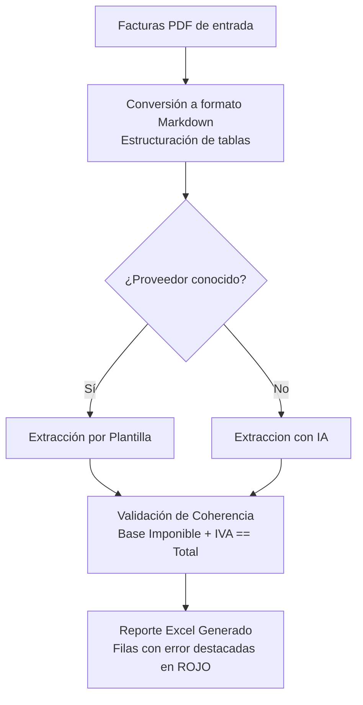

# Ingesta y Registro Automático de Facturas PDF a Excel

Este proyecto automatiza la ingesta, lectura y consolidación de facturas electrónicas en formato PDF, estructurando la información directamente en un reporte de Excel listo para la conciliación fiscal y la preparación de anexos transaccionales. 

El sistema reduce la carga operativa del departamento de contabilidad y finanzas al eliminar la digitación manual y aplicar reglas de validación automática para asegurar la calidad de la información antes de su registro definitivo.

---

## Justificación del Proyecto e Impacto en el Negocio

En los cierres mensuales, el equipo de contabilidad y tesorería suele destinar muchas  horas a descargar facturas de proveedores recurrentes (como servicios bancarios o de telecomunicaciones) y transcribir manualmente datos complejos como números de autorización de 49 dígitos, RUCs, fechas de emisión y desgloses de impuestos. Este proceso no solo consume tiempo, sino que incrementa la probabilidad de errores tipográficos que luego dificultan la conciliación bancaria o generan inconsistencias en los anexos fiscales.

### Impacto Operativo

Este sistema transforma el flujo de trabajo tradicional en un modelo eficiente de supervisión y gestión por excepciones:

*   **Optimización del Tiempo:** El procesamiento de un lote de facturas pasa de requerir horas de transcripción manual a completarse en pocos segundos de ejecución automatizada.
*   **Reducción del Margen de Error:** Al automatizar la extracción de datos mediante algoritmos y validarlos antes de su almacenamiento, se eliminan los errores de digitación de números de autorización y RUCs.
*   **Detección Inmediata de Discrepancias:** El validador aritmético integrado asegura la coherencia matemática de cada documento, permitiendo al analista enfocarse únicamente en corregir las excepciones detectadas por el sistema.

---

## Enfoque de Procesamiento: Reglas Deterministas y Respaldo con Inteligencia Artificial

Para optimizar la precisión y mantener un control estricto de los costos, el sistema utiliza un enfoque híbrido que combina extracción determinista para proveedores conocidos y con inteligencia artificial para casos no contemplados en el catálogo de proveedores.

| Criterio | Motor de Reglas (Predeterminado) | Extracción con Inteligencia Artificial (Fallback) |
| :--- | :--- | :--- |
| **Costo por factura** | Sin costo (ejecución 100% local) | Variable según consumo de API |
| **Privacidad de datos** | Completa (los datos no salen del entorno local) |Depende del plan (pagado = no se usa para netrenar modelos) o modelo local para privacidad total |
| **Consistencia** | Totalmente predecible (mismo documento = idéntico resultado) | Alta, gracias a un esquema JSON estricto que restringe la salida del modelo¹ |
| **Mantenimiento** | Requiere definir un patrón por cada nuevo formato | Se adapta automáticamente a nuevos formatos sin intervención manual |

¹ *El riesgo de alucinaciones se controla mediante un esquema de datos estricto (contrato JSON) y validación aritmética posterior — cualquier extracción inconsistente se marca automáticamente para revisión manual, sin necesidad de supervisión humana constante.*

### Flujo de Trabajo Híbrido

1.  **Conversión de PDF a Texto Estructurado:** Las facturas en formato PDF se convierten a Markdown, lo que preserva la estructura de tablas y facilita una búsqueda precisa de la información.
2.  **Extracción por Reglas (100% Determinista):** Si el proveedor es identificado dentro del catálogo preconfigurado, el sistema aplica plantillas de expresiones regulares diseñadas específicamente para ese formato de factura.
3.  **Respaldo con Inteligencia Artificial (Fallback):** En caso de procesar un documento de un proveedor nuevo o desconocido, el sistema redirige automáticamente el texto a un modelo de lenguaje avanzado (**Google Gemini 1.5 Flash**) utilizando un esquema estricto de datos en formato JSON para extraer la información estructurada sin interrumpir el proceso de lote.




<!--  -->

---

## Arquitectura y Estructura Técnica del Proyecto

El código está estructurado bajo un diseno modular para facilitar su mantenimiento y permitir la adición de nuevos formatos de factura sin modificar la lógica principal de procesamiento.

*   **Extensibilidad del Catálogo:** Para dar soporte a un nuevo emisor de facturas, basta con añadir una nueva estructura de expresiones regulares en el archivo de plantillas, sin necesidad de alterar el orquestador principal.
*   **Validación de Datos por Contrato:** Se define un esquema unificado de datos contables. Este esquema es consumido por los módulos de extracción y por la inteligencia artificial, asegurando que todos los reportes sigan exactamente la misma estructura de campos.
*   **Validación Matemática Preventiva:** El validador aritmético comprueba que la suma de la Base Imponible y el IVA coincida exactamente con el Total registrado en la factura. En caso de discrepancias, el sistema aísla el registro para proteger la integridad del reporte contable final.

### Estructura de Archivos

```
├── main.py                     # Orquestador principal del pipeline de facturación
├── explorar_factura.py         # Utilidad para analizar el contenido de nuevos PDFs
├── procesar_conciliacion.bat   # Acceso directo para Windows (ejecución sin usar consola)
├── core/
│   ├── procesamiento.py        # Conversión de PDF y despacho según proveedor
│   ├── validador.py            # Comprobaciones matemáticas y campos obligatorios
│   ├── extractor_ia.py         # Extracción asistida con la API de Google Gemini
│   └── exportador_excel.py     # Generación del archivo Excel estructurado y con formato visual
├── plantillas/
│   ├── esquema.py              # Definición de campos obligatorios y formato
│   ├── plantillas_fct.py       # Expresiones de extracción específicas por proveedor
│   └── registro.py             # Registro de formatos y emisores activos
├── facturas_pdf/               # Carpeta contenedora de facturas para procesar
└── salida/                     # Carpeta de destino del reporte Excel final
```

---

## Reporte de Salida y Gestión de Excepciones

Una vez finalizado el procesamiento, el sistema genera un reporte en formato Excel .


Para optimizar el tiempo de revisión, el archivo aplica formatos de celda específicos: las facturas válidas se registran de forma ordinaria, mientras que aquellas que presentan errores aritméticos, campos vacíos o inconsistencias críticas se resaltan automáticamente en **rojo claro**. Esto permite al equipo de contabilidad aplicar una auditoría enfocada exclusivamente en los documentos con anomalías de extracción o de emisión.


---

## Guía de Uso

### Requisitos Previos

1. Disponer de Python 3.10 o superior instalado en el sistema.
2. Instalar las dependencias necesarias mediante la consola:
   ```bash
   pip install -r requirements.txt
   ```
3. Configurar la clave de acceso de Gemini para habilitar el procesamiento inteligente de facturas no clasificadas:
   ```bash
   # En Windows (CMD)
   set GEMINI_API_KEY=tu_api_key_aquí

   # En Linux/macOS
   export GEMINI_API_KEY="tu_api_key_aquí"
   ```

### Instrucciones de Ejecución

1.  Deposite las facturas en formato PDF que desea conciliar dentro de la carpeta `facturas_pdf/`.
2.  Inicie el procesamiento de la forma que le resulte más conveniente:
    *   **Doble Clic (Windows):** Ejecute el archivo `procesar_conciliacion.bat` directamente desde su explorador de archivos.
    *   **Consola de comandos:** Ejecute el comando `python main.py`.
3.  Abra el reporte generado en `salida/facturas_extraidas.xlsx` y revise únicamente las filas marcadas en color rojo.

---

## Próximos Pasos y Escalabilidad

Con el fin de integrar este sistema en flujos de trabajo más amplios y robustos, se contemplan las siguientes mejoras operativas:

1.  **Conexión Directa a Correo Electrónico:** Habilitar un servicio de lectura automática mediante protocolo IMAP para descargar y procesar las facturas adjuntas que llegan a un buzón corporativo específico de proveedores.
2.  **Pruebas Automatizadas de Extracción:** Implementar una suite de pruebas para verificar de manera continua que las actualizaciones en las expresiones regulares no afecten la precisión de las plantillas existentes.
3.  **Despliegue en la Nube:** Empaquetar la aplicación en un contenedor Docker para facilitar su despliegue como microservicio o tarea programada en plataformas de nube (AWS, Google Cloud).
4.  **Sistema de Registro Profesional:** Reemplazar el flujo actual de mensajes por pantalla con el sistema nativo de logging de Python, permitiendo mantener un registro histórico de incidencias de manera persistente.