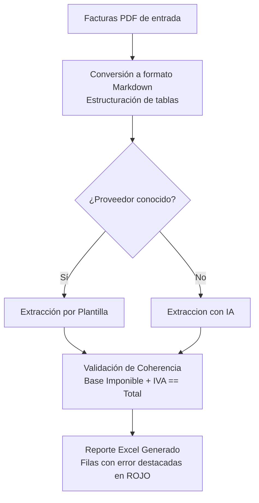
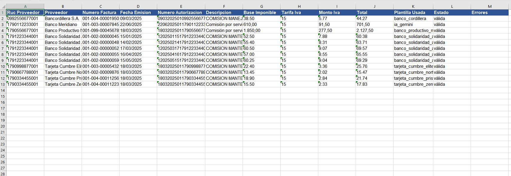

# Ingesta y Registro Automático de Facturas PDF a Excel

El proyecto automatiza la ingesta, lectura y consolidación de facturas electrónicas que se reciben en formato PDF, estructurando la información en un reporte de Excel listo para preparar el anexo transaccional fiscal y su posterior registro contable.

El equipo contable destina muchas horas a descargar facturas de proveedores recurrentes (servicios bancarios generan facturas por IVA de comisiones) y transcribir manualmente números de autorización de 49 dígitos, RUCs, fechas de emisión y desgloses de impuestos. Es una tarea que genera carga y retrasos en el cierre, producto del volumen de facturas por registrar, además de aumentar el riesgo de errores por mala digitación.

La implementación del proyecto reduce la carga operativa y el tiempo destinado a la digitación manual y, además, aplicando la validación de montos, asegura la precisión de la información extraída antes de su registro definitivo.


## Enfoque de Procesamiento: Reglas Deterministas y Respaldo con Inteligencia Artificial


Para optimizar la precisión y mantener un control estricto de los costos, el sistema utiliza un enfoque híbrido que combina extracción determinista para proveedores conocidos y con inteligencia artificial para casos no contemplados en el catálogo de proveedores. 
Cualquier extracción inconsistente se marca automáticamente para revisión manual .


### Flujo de Trabajo Híbrido

1.  **Conversión de PDF a Texto Estructurado:** Las facturas en formato PDF se convierten a Markdown, lo que preserva la estructura de tablas y facilita una búsqueda precisa de la información.
2.  **Extracción por Reglas (100% Determinista):** Si el proveedor es identificado dentro del catálogo preconfigurado, el sistema aplica plantillas de expresiones regulares diseñadas específicamente para ese formato de factura.
3.  **Respaldo con Inteligencia Artificial (Fallback):** En caso de procesar un documento de un proveedor nuevo o desconocido, el sistema redirige automáticamente el texto a un modelo inteligencia artificial ,utilizando un esquema estricto de datos en formato JSON para extraer la información estructurada sin interrumpir el proceso de lote.




<!--  -->

---

## Estructura  del Proyecto

El código está estructurado bajo un diseno modular para facilitar su mantenimiento y permitir la adición de nuevos formatos de factura sin modificar la lógica principal de procesamiento.


Para dar soporte a un nuevo emisor de facturas, basta con añadir una nueva estructura de expresiones regulares en el archivo de plantillas, sin necesidad de alterar el orquestador principal.

Se define un esquema unificado de datos contables. Este esquema es consumido por los módulos de extracción y por la inteligencia artificial, asegurando que todos los reportes sigan exactamente la misma estructura de campos.

El validador aritmético comprueba que la suma de la Base Imponible y el IVA coincida exactamente con el Total registrado en la factura. En caso de discrepancias, el sistema aísla el registro para proteger la integridad del reporte contable final.


```
├── main.py                     # Orquestador principal del pipeline de facturación
├── explorar_factura.py         # Utilidad para analizar el contenido de nuevos PDFs
├── procesar_conciliacion.bat   # Acceso directo para Windows (ejecución sin usar consola)
├── core/
│   ├── procesamiento.py        # Conversión de PDF y despacho según proveedor
│   ├── validador.py            # Comprobaciones matemáticas y campos obligatorios
│   ├── extractor_ia.py         # Extracción asistida con la API de Google Gemini
│   └── exportador_excel.py     # Generación del archivo Excel estructurado y con formato visual
├── plantillas/
│   ├── esquema.py              # Definición de campos obligatorios y formato
│   ├── plantillas_fct.py       # Expresiones de extracción específicas por proveedor
│   └── registro.py             # Registro de formatos y emisores activos
├── facturas_pdf/               # Carpeta contenedora de facturas para procesar
└── salida/                     # Carpeta de destino del reporte Excel final
```

---

## Reporte de Salida y Gestión de Excepciones

Una vez finalizado el procesamiento se genera un reporte en formato Excel .



Para optimizar el tiempo de revisión, se aplican  formatos de celda específicos: las facturas válidas se registran de forma ordinaria, mientras que aquellas que presentan errores aritméticos, campos vacíos o inconsistencias críticas se resaltan automáticamente en rojo claro . Esto permite enfocarse  exclusivamente en los documentos con anomalías de extracción o de emisión.


---

## Robustez y Tolerancia a Fallos

Se desarrolla el codigo pensando en soportar condiciones reales en produccion,las cuales se detallan a continuacion : 

### 1. Aislamiento de Errores por Documento
Se implementó un aislamiento con bloques de captura de excepciones en el bucle principal. Si un PDF resulta ilegible o está dañado, el sistema captura el error de lectura, registra el incidente de forma organizada en el reporte de salida con estado `"error de lectura"`, y continúa procesando el resto de las facturas del lote de forma ininterrumpida.

### 2. Escritura Segura de Reportes (Defensa de Bloqueo de Excel)
El exportador maneja la excepción de permisos (`PermissionError`). Si detecta que el archivo está bloqueado o el usuarioo lo mantiene abierto al iniciar la extraccon , genera de forma automática una copia de seguridadcon una una marca de tiempo (ej. `facturas_extraidas_20260811_162354.xlsx`) e informa detalladamente al usuario a través del sistema de logging.

### 3. Registro (Logging)
Se integró el sistema nativo de logging de Python (`core/logger.py`), reemplazando las impresiones de consola tradicionales. Se almacena un historial detallado de las ejecuciones, advertencias de validación e incidencias en el archivo `logs/procesamiento.log` para auditoría y depuración posterior.

---

## Guía de Uso

### Requisitos Previos

1. Disponer de Python 3.10 o superior instalado en el sistema.
2. Instalar las dependencias necesarias mediante la consola:
   ```bash
   pip install -r requirements.txt
   ```
3. Configurar la clave de acceso del modelo de inteligencia artifical  para habilitar el procesamiento  de facturas no clasificadas:
   ```bash
   # En Windows (CMD)
   set MODELO_API_KEY=tu_api_key_aquí

   # En Linux/macOS
   export MODELO_API_KEY="tu_api_key_aquí"
   ```

### Instrucciones de Ejecución

1.  Deposite las facturas en formato PDF que desea conciliar dentro de la carpeta `facturas_pdf/`.
2.  Inicie el procesamiento de la forma que le resulte más conveniente:
    *   **Doble Clic (Windows):** Ejecute el archivo `procesar_conciliacion.bat` directamente desde su explorador de archivos.
    *   **Consola de comandos:** Ejecute el comando `python main.py`.
3.  Abra el reporte generado en `salida/facturas_extraidas.xlsx` y revise únicamente las filas marcadas en color rojo.

---

## Próximos Pasos y Escalabilidad

Con el fin de integrar este sistema en flujos de trabajo más amplios e contemplan las siguientes mejoras operativas:

**Conexión Directa a Correo Electrónico:** Conectarlo al correo para que lea las facturas que llegan de forma automática, sin necesidad de descarga manual.

---

